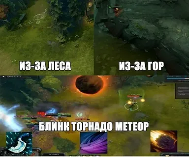
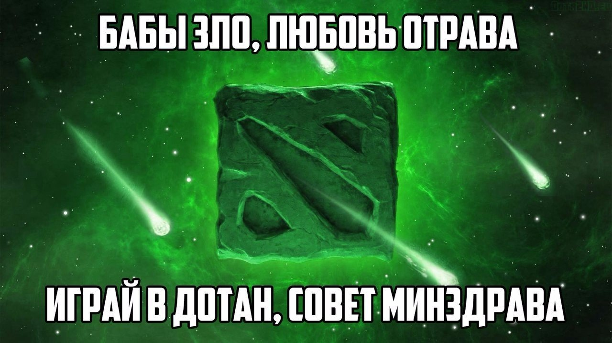
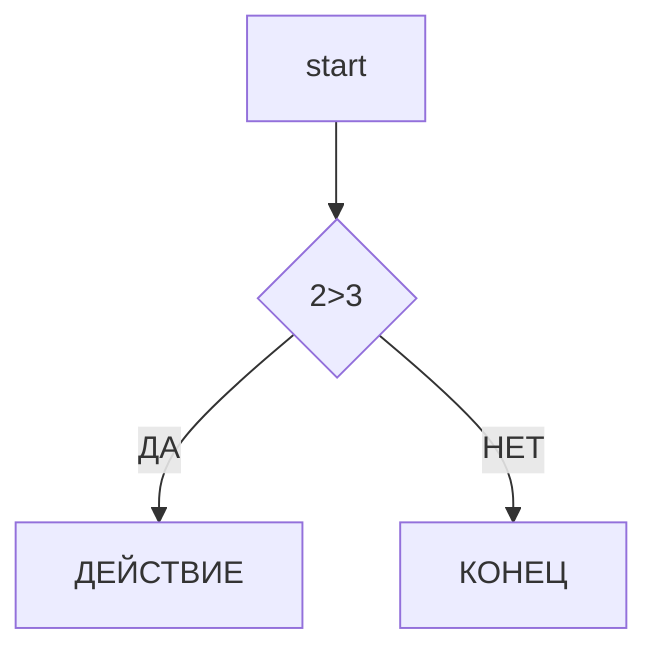

# djswega

## 123

### 532

# **ТИПЫ ТЕКСТА**

**PUDGE**

~PUDGE~

`PUDGE`

[PUDGE][1]

# **СПИСКИ**

- СОЛЬ

- МУКА

- ОВОЩИ
 
  1. ПОМИДОРЫ

  2.ОГУРЦЫ

# ССЫЛКИ

[MY TIK TOK](https://www.tiktok.com/@milozis)

[1]: https://www.tiktok.com/@milozis 

[MY STEAM](https://steamcommunity.com/profiles/76561199435490548/  " ТУТ Я ИГРАЮ")

# ИЗОБРАЖЕНИЯ




[](https://www.dota2.com/home/)

# КОД

```python
c=a+b
print(f"{c} = {a} + {b}")
```
# ТАБЛИЦЫ

| NAME | AGE | CITY |
| ----:|:---:| :---:|
| asd | 12 | moskow |
| dsa | 42 | moskow |
| sad | 32 | moskow |

# ЭКРАНИРОВАНИЕ

\#DOTA

# ДИАГРАММЫ



# ЗАГОЛОВКИ

-[ЗАГОЛОВКИ](#1-ЗАГОЛОВКИ)

-[СПИСКИ](#1-СПИСКИ)

